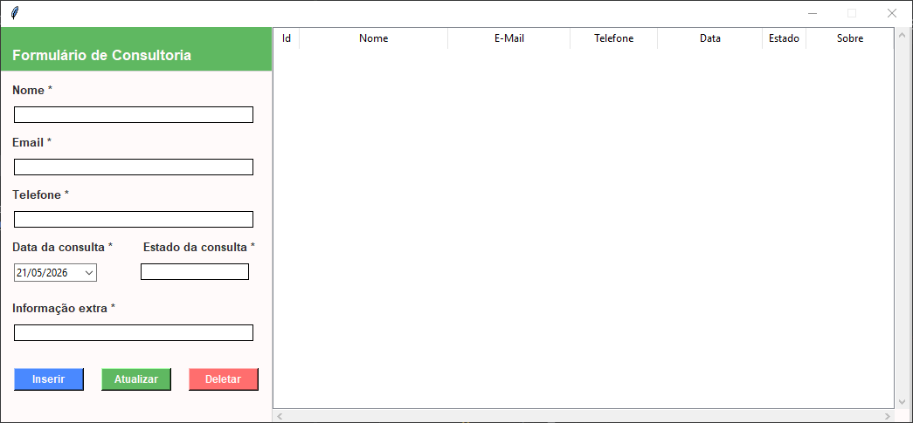
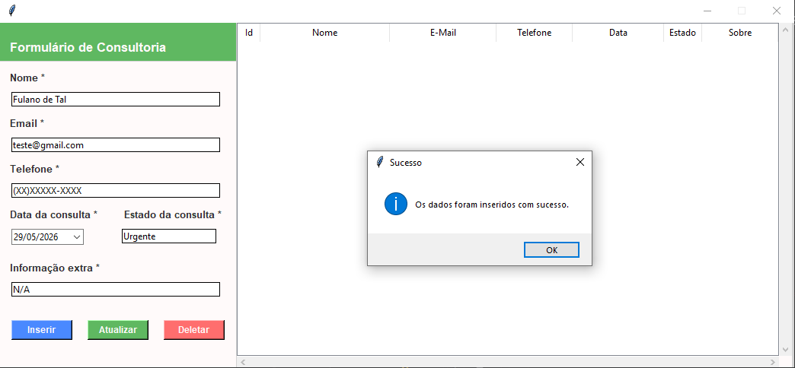
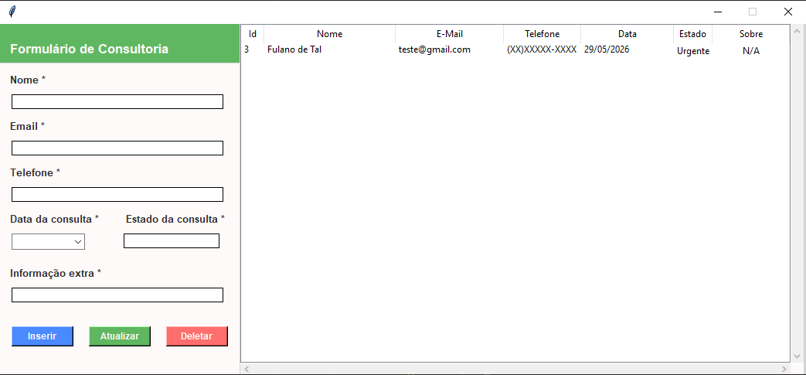
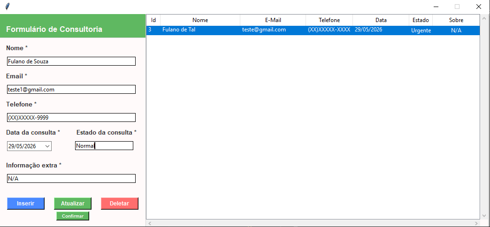
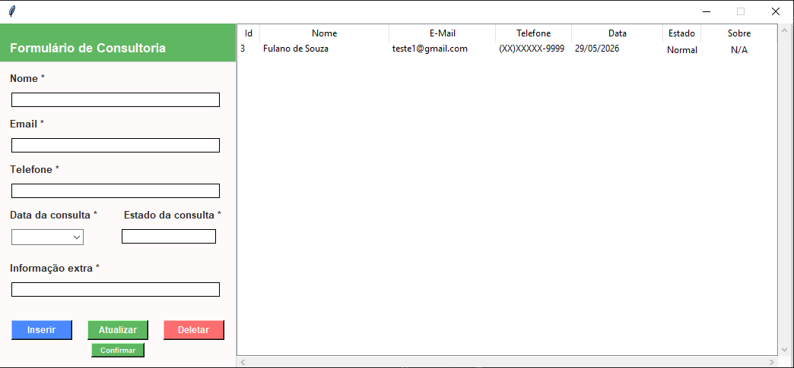

# Sistema CRUD em Python 

---

Projeto de CRUD em Python utilizando as bibliotecas Tkinter para interface gráfica e SQLite para banco de dados com fins educacionais.

## Instalação

Clone o repositório

    git clone https://github.com/luiscirino/crud-python.git

Entre no diretório do projeto

    cd crud-python

Instale as dependências

    pip install -r requirements.txt

Crie o banco de dados (caso não exista)

    python banco.py

Rode o programa

    python main.py

## Screenshots

### 1. Tela principal do programa

### 2. Tela ao inserir dados

### 3. Dados inseridos

### 4. Ao atualizar os dados

### 5. Dados atualizados

## Créditos

Projeto desenvolvido com base na [playlist](https://www.youtube.com/playlist?list=PLGFzROSPU9oW8qWQh-5agQSEp_aQgiXs6) do canal Dev Nómada | João.
